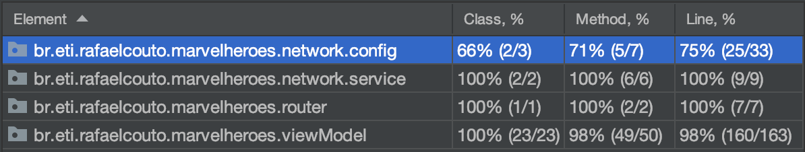
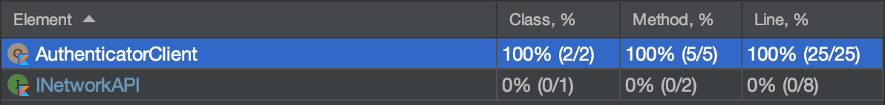
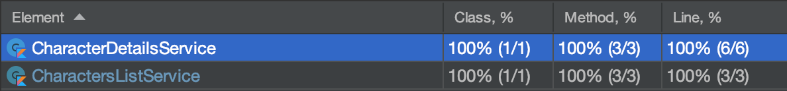
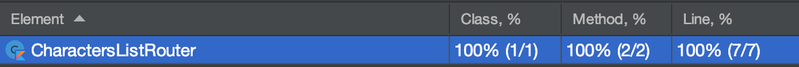
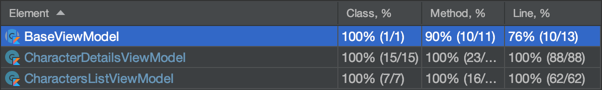

# Marvel Characters

Projeto realizado para avaliação de técnicas de desenvolvimento Android.

### A tarefa

Criar um aplicativo que utilize a API pública da Marvel.

Esse aplicativo deverá listar os personagens em uma tela com rolagem infinita e apresentar os detalhes do personagem em uma tela auxiliar com suas devidas participações em Comics (informação disponível na API).

### Sobre o projeto

*  Técnica de desenvolvimento: _Test Driven Development_ (**TDD**);
*  Arquitetura: _Model View ViewModel_ (**MVVM**);
*  Linguagem: **Kotlin 1.3.72**;
*  IDE: **AndroidStudio 3.6.3**;
*  **Gradle 3.6.3**, _dist_ **5.6.4**;
*  Demais informações técnicas:
    *  Projeto utilizando **AndroidX**;
    *  Implementação de **Menu** e **SearchView**;
    *  _Layouts_ utilizam **RecyclerView**, **NestedScrollView** e **ConstraintLayout**;
    *  Análise de código com **Ktlint 0.36.0**;
    *  Utilização de **DataBinding**, **Lifecycle 2.2.0** e **ReactiveExtensions**:
        *  **RxAndroid 2.1.1**;
        *  **RxJava 2.2.10**;
        *  **RxKotlin 2.4.0**.
    *  Dependências para API _digest_:
        *  **Retrofit 2.7.1**;
        *  **Gson Converter 2.7.1**;
        *  **RxJava2 Adapter 2.7.1**;
        *  **OkHttp LoggingInterceptor 4.4.0**;
        *  **Picasso 2.5.2**.
    *  Dependências para testes unitários:
        *  **JUnit 4.12**;
        *  **Mockito 3.1.0**;
        *  **MockitoKotlin 2.2.0**;
        *  **MockWebServer 4.4.0**;
        *  **Robolectric 4.1**.

### Características da aplicação
* Tela inicial: lista de personagens por ordem alfabética (retorno padrão da API), apresentada em uma _grid_ com 3 colunas. São exibidos 20 personagens por página. É possível filtrar os personagens por nome, com a nova lista representando personagens cujo nome inicie com o termo utilizado.
* Tela de detalhes: nome, imagem e descrição do personagem, assim como uma lista com rolagem infinita das _comics_ em que apareceu, exibidas em uma _grid_ de 2 colunas, 10 _comics_ por página.
* Caso alguma requisição falhe, é possível solicitar sua repetição.
* Cenários que envolvem mais de uma requisição para carregar o conteúdo da tela foram otimizados com chamadas paralelas.

### Blueprint

O projeto foi desenvolvido considerando as seguintes camadas:

* _Model_: define a estrutura dos dados que transitam no app e o contrato que deve ser aguardado da API.
* _Network_: realiza chamadas de API para o backend. Nesta camada ficam as configurações da API e os _Services_.
* _Navigation_: realiza o fluxo de telas no app. Nesta camada ficam os _Routers_.
* _Business_: trata das regras de negócio do projeto. Nesta camada ficam as _ViewModels_.
* _View_: apresenta as informações para o usuário. Nesta camada ficam as _Activities_, _Adapters_ e _ViewHolders_.

### Testes Unitários

Foram realizados testes unitários nas camadas de _Network_, _Navigation_ e _Business_.

A cobertura geral dos testes ficou da seguinte maneira:

A cobertura por camada ficou da seguinte maneira:

* _Network_:

* _Navigation_:

* _Business_:

